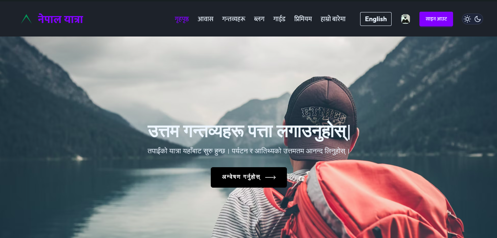
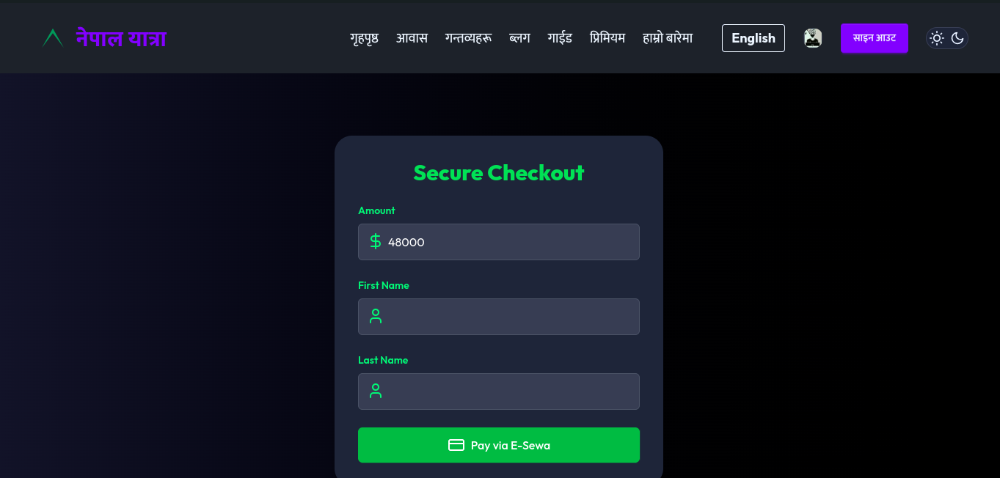

<!DOCTYPE html>
<html lang="en">
<head>
  <meta charset="UTF-8">
  <meta name="viewport" content="width=device-width, initial-scale=1">
</head>
<body>
  <h1>Nepal Yatra</h1>
  

    Nepal Yatra is a travel website designed to promote tourism in Nepal. It provides a comprehensive platform for travelers to explore various destinations, book tours, and get useful information about traveling in Nepal.
  

  
  

  <h2>Features</h2>
  
  <h3>1. Tour Packages</h3>
  <ul>
    <li>A collection of travel packages that showcase various destinations in Nepal.</li>
    <li>Detailed itineraries for each package to help users plan their trip.</li>
  </ul>
  
  <h3>2. Booking System</h3>
  <ul>
    <li>Users can book travel packages directly from the website.</li>
    <li>Provides a smooth and easy-to-use booking process.</li>
  </ul>
  
  <h3>3. Travel Blog</h3>
  <ul>
    <li>Articles and guides on the best places to visit, local customs, and helpful travel tips.</li>
  </ul>
  
  <h3>4. Contact &amp; Inquiry Form</h3>
  <ul>
    <li>A contact form for users to inquire about custom trips, questions, and bookings.</li>
  </ul>
  
  <h3>5. User Authentication</h3>
  <ul>
    <li>Secure sign-up, log-in, and user profile management for handling bookings and personal details.</li>
  </ul>
  
  <h2>Tech Stack</h2>
  <ul>
    <li><strong>Frontend:</strong> React, Tailwind CSS, React Router</li>
    <li><strong>Backend:</strong> Node.js, Express</li>
    <li><strong>Database:</strong> MongoDB</li>
    <li><strong>Authentication:</strong> JWT</li>
    <li><strong>Email Service:</strong> Nodemailer (for email notifications)</li>
    <li><strong>Others:</strong> Mongoose (ODM), Axios (for API requests)</li>
  </ul>
  
  <h2>Screenshots</h2>
  
  <h3>Homepage</h3>
  
  
  <h3>Booking Page</h3>
  
  
  <h2>Installation</h2>
  
To run this project locally, follow these steps:

  
  <h3>1. Clone the repository:</h3>
  <pre><code>git clone https://github.com/Hack-the-Future-0-1/Coding-Heroes.git</code></pre>
  
  <h3>2. Navigate to the project directory:</h3>
  <pre><code>cd Coding-heroes</code></pre>
  
  <h3>3. Install dependencies:</h3>
  <h4>For the frontend:</h4>
  <pre><code>cd frontend
npm install</code></pre>
  
  <h4>For the backend:</h4>
  <pre><code>
npm install</code></pre>
  
  <h3>4. Set up environment variables</h3>
  
Create a <code>.env</code> file in both the <code>client</code> and <code>server</code> folders and add the necessary environment variables.

  
  <h4>For the <code>server/.env</code> file:</h4>
  <pre><code>MONGO_URI=mongodb://your_mongodb_connection_string
JWT_SECRET=your_jwt_secret
EMAIL_HOST=smtp.your-email-provider.com
EMAIL_PORT=587
EMAIL_USER=your-email@example.com
EMAIL_PASS=your-email-password</code></pre>
  
  <h4>For the <code>client/.env</code> file:</h4>
  <pre><code>REACT_APP_API_URL=http://localhost:5000</code></pre>
  
  <h3>5. Run the app</h3>
  <h4>For the frontend:</h4>
  <pre><code>cd frontend
npm run dev</code></pre>
  
The frontend will be available at <code>http://localhost:5173</code>.

  
  <h4>For the backend:</h4>
  <pre><code>cd server
npm start</code></pre>
  
The backend will be available at <code>http://localhost:8000</code>.

  
  <h2>Contributing</h2>
  
We welcome contributions! To get started, please follow these steps:

  <ol>
    <li>Fork the repository.</li>
    <li>Create a new branch:
      <pre><code>git checkout -b feature-branch</code></pre>
    </li>
    <li>Make your changes and commit them:
      <pre><code>git commit -m "Add new feature"</code></pre>
    </li>
    <li>Push to the branch:
      <pre><code>git push origin feature-branch</code></pre>
    </li>
    <li>Create a new Pull Request.</li>
  </ol>
  
  <h2>License</h2>
  
This project is licensed under the MIT License - see the <a href="LICENSE">LICENSE</a> file for details.

  
  <h2>Acknowledgements</h2>
  <ul>
    <li>Thanks to the contributors and everyone who helped make this project possible!</li>
    <li>Special thanks to <a href="https://tailwindcss.com/">Tailwind CSS</a> for their wonderful utility-first framework and <a href="https://reactjs.org/">React</a> for its powerful frontend capabilities.</li>
  </ul>
  
  <h2>Contact</h2>
  
For inquiries or suggestions, feel free to contact us at:

  <ul>
    <li><strong>Email:</strong> <a href="mailto:info.nepalyatra@gmail.com">info.nepalyatra@gmail.com</a></li>
    <li><strong>Phone:</strong> +977 9806498176</li>
  </ul>
</body>
</html>
